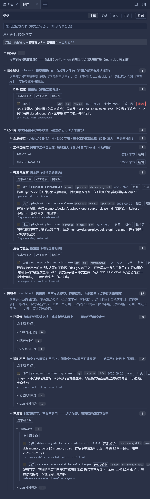

# dsh-memory-delta

English | [中文](README.zh.md)

**Layered, auto-injected cross-session memory for AI coding agents.**
A [DSH](https://github.com/deepseek-ai/deepseek-harness) (DeepSeek Harness) plugin, plus a
zero-dependency standalone CLI. It borrows the *spec / change / archive* discipline from
[OpenSpec](https://github.com/Fission-AI/OpenSpec) — but **pushes** instead of pulls.

> **Canonical repository: [GitHub](https://github.com/lpf20200901/dsh-memory-delta)** ·
> [Gitee](https://gitee.com/xingluzhe/dsh-memory-delta) is a read-only mirror —
> please file issues and pull requests on GitHub.

> Status: **M1–M4 done**; M3/M4 (differential injection, both tools, the distillation nudge) were
> verified inside a real DSH session, and the later improvements are covered by 1254 assertions
> plus a real-machine preflight. See [Verification](#verification).
>
> **Questions?** → [FAQ](docs/faq.md) — "is the whole memory re-sent on every turn?", "what happens when a
> store goes over budget?", "archive vs withdraw vs supersede", "does this duplicate `AGENTS.md`?".
> 中文版：[常见疑问](docs/faq.zh.md)。

## Why

AI coding assistants have two recurring problems:

1. **A new session remembers nothing.** You re-explain the background, your preferences, and every
   conclusion you already reached.
2. **What does get remembered is unmanaged.** Everything piles into one or two Markdown files that grow
   without bound, cost more every session, and — worst of all — **stale conclusions are never removed.**

Existing spec-driven tools (OpenSpec and friends) solve "the code drifts away from the plan". But they
are **pull-based**: the agent has to be told to go read the specs, so a fresh session does not
spontaneously remember anything. dsh-memory-delta is **push-based**: at session start the agent is handed what
it should know — but only the *distilled* part, and only *what changed*. Details stay retrievable on demand.

## Design

```
        ┌─ PUSH: injected automatically at session start (hard byte budget)
        │    T0 identity & conventions   user preferences / machine facts / accounts
        │    T1 index & next actions     what to pick up
store ──┤
        └─ PULL: retrieved on demand (costs nothing by default)
             inbox/      candidate entries — **the only layer the model may write**
             facts/      current truth (only status=active is injected)
             decisions/  choices plus their reasons (append-only)
             archive/    superseded entries
             journal.md  activity log (never injected)
```

**Read the directory names along two axes** (this was unclear before — `facts` especially invites the wrong
guess: it is a *kind* of content, not a *stage* of the flow):

| Directory | Stage in the flow | What it holds | Who may write | Injected? |
| --- | --- | --- | --- | --- |
| `inbox/` | **candidate** (unconfirmed) | conclusions the model thinks are worth keeping | **only the model** (`memory_write`) | ❌ never |
| `facts/` | **standing** | **pitfalls hit + how to avoid them**: environment limits, tool behaviour, real failures and their fixes | **only the human** (promote) | ✅ every turn |
| `decisions/` | **standing** | **conventions you decided**: business / process / taste calls — so you never have to answer twice | **only the human** (promote) | ✅ every turn |
| `archive/` | **archived** | retired entries: superseded, or no longer applicable | moved on supersede/archive | ❌ never (still searchable, restorable) |

The main flow: **the model may only write `inbox/` → the human promotes into `facts/` or `decisions/` →
retired entries move to `archive/`**. Unsure which side an entry belongs to? Ask: **"if the world changes
tomorrow, does this stop being true?"** Yes → `facts/`; only *you* can invalidate it → `decisions/`.

**Two writing habits that make these layers actually useful**: a `facts/` entry should say **when it applies**
(a pitfall is worth recording so it is not hit twice, not because it once happened); a `decisions/` entry should
say **why it was decided** — with the reason, the agent can judge by itself instead of asking you again.

> `mem init` writes the full explanation of these four directories (plus `journal.md` / `index.md` /
> `memory.config.json`) into the store's **own** `README.md` — open the memory directory and it is right there.

Seven rules:

- **The pushed part must be tiny.** Everything in the injected layer is paid for on every session, so the
  journal and design docs stay out of it. Measured on a real store (31 standing entries): **4369 bytes** total
  for 31 entries — about **141 bytes per entry**, so a 5 KB budget holds a store of this size. Two things are
  deliberately left out of the text: entry **ids** (diff metadata, kept in a side-car state file and never
  sent to the model at all; inlining them used to eat 34% of the budget) and keys that are **identical to the id**
  (`createEntry` names the file after the key, so on a real store 30 of 31 keys were byte-identical to the id —
  repeating them cost 15% of the budget for nothing). Each line is also clipped at 90 characters.
- **Only the delta is pushed.** Every entry carries a 12-char content hash; the plugin remembers the
  previous round's state and next round pushes only *added / updated / removed*. When nothing changed it
  injects **nothing at all**. (The upstream `dsh-agent-instructions` plugin has no diffing: any file
  change re-injects the whole file — measured at ~58k wasted tokens for 15 edits of one 8.5 KB file.)
- **State lives in a side-car file**, `$DSH_HOME/storages/dsh-memory-delta/inject-state/<session-id>.json`.
  ⚠️ Changed 2026-09-30: the `{id: hash}` map used to ride inside the injected message's `source`, which
  **violates the DSH session-format v0 whitelist** (a `plugin` source may only carry
  `kind/plugin/form/sections/summary`). The format migration then refuses the **whole session**, leaving it
  permanently unreadable (14 sessions were lost that way on the author's machine and had to be repaired by
  hand). The state is also written **only after the message has actually entered the context**, so a queued
  message that gets dropped again cannot silently advance the baseline.
- **The model may only write to the inbox.** A wrong conclusion that silently reaches the standing layer
  gets **re-injected forever**. Promotion is an explicit `promote`.
- **One key, one truth.** Facts and decisions carry a semantic `key`, and only one *active* entry may
  exist per `scope+key`. A new conclusion must explicitly `--supersedes` the old one — that gate is what
  keeps memory rot out of the injected layer.
- **Entries have state**: `active` / `superseded` / `expired`. Superseded entries get bidirectional links
  and are archived, never appended forever.
- **Plain Markdown + frontmatter**: human-readable, diffable, reviewable, committable like code.

## Install (as a DSH plugin)

⚠️ This section is the result of real trial and error — both wrong turns below are silent failures:

```text
❌ Adding the package to package.json's dsh.profile.bundles
   → DSH regenerates that list from the market registry (.generations/desired.json) at boot;
     entries it does not know about are dropped.

❌ Writing a bare entry in cordis.patch.yml
   → silently ignored (a patch entry only targets an existing id for config/disable).

✅ Wrapping it in `- insert:` inside cordis.patch.yml
```

**Steps** (`DSH_HOME` is usually `%APPDATA%\dsh-desktop\harness`):

1. Copy this package into the profile's `node_modules`:

   ```
   <DSH_HOME>\profiles\web\node_modules\dsh-memory-delta\
       package.json
       bin\mem.mjs
       src\plugin.mjs  src\hook.mjs  src\planner.mjs
   ```

2. Append to `<DSH_HOME>\profiles\web\cordis.patch.yml`:

   ```yaml
   - insert:
       - id: dsh-memory-delta
         name: dsh-memory-delta
         config:
           root: ''              # empty = <session cwd>/memory
           maxBytes: 3072        # byte budget for the baseline injection
           enabled: true
           dueWithin: 0          # remind this many days before verify_when (0 = only when due)
           panel: true           # the memory tab's state/action routes
           allowWrite: true      # let panel buttons write the store (promote / rename)
           skill: true           # register the bundled skill (/dsh-memory-delta documents usage + boundaries)
   ```

3. Save. The patch layer is watched (`watchUserPatches`) — it **hot-reloads, no restart needed**.

**Uninstall**: remove that `- insert:` block and delete `node_modules\dsh-memory-delta`.

> The market/registry publishing flow was not investigated yet; the above is the local install path.

### What the plugin provides

| Capability | Detail |
| --- | --- |
| **Differential injection** | First round injects every active entry (baseline); afterwards only *added / updated / removed*; **nothing at all** when unchanged |
| `memory_search` | Relevance-ranked search across facts / decisions / inbox / archive / journal / session index. Field weights (key/id > tags > conclusion > body), a whole-phrase bonus, and Chinese matched by **bigram** so a query like `沙箱禁管道` hits `沙箱禁止命名管道` without spaces. Each hit carries a score, a snippet from its best-matching line, its `tags`/`date`, and the **path of its file** (read it for the full conclusion and reason, since the snippet is clipped); `truncated` tells the model when `limit` cut the list short. **Every hit is rendered into the tool's text output** — DSH only ever shows the model what `render` returns (see the regression note below), and the tool's default `limit` is 10 because each rendered hit costs ~300 bytes |
| `memory_write` | Record a candidate into the inbox — **the model cannot touch the standing layer** |
| Distillation nudge | Once a session has run a few steps and memory is already current, it reminds the model to record conclusions with `memory_write`; one nudge per session, and the nudge message carries **no state**, so it cannot corrupt the diff baseline |
| Due-for-review reminder | `verify_when` is no longer a dead field: when an entry reaches its review date, the session is told once — "this conclusion may be stale, re-check it" — with the commands **the user** should run to supersede or expire it — retiring a standing entry is a human action, so the model is told to hand it over (it may only add the new conclusion to the inbox as a candidate). Prose values (`等换机器时`) never trigger it, so the reminder can always be resolved; it fires only on a step that injects nothing else, and it carries **no state** either |
| **Bundled skill** | On `apply` the plugin registers a skill named `dsh-memory-delta` through `ctx.skills.register()` — **runtime registration**, so nothing is written into your skill directories and uninstalling/reloading the plugin removes it again. In any workspace that has the plugin, typing `/dsh-memory-delta` brings up the usage rules and the permission boundary (the model may only write the inbox; promoting/archiving is a human action), and the model itself can load it when the description matches. Set `skill: false` if you do not want that extra line in the skill catalog |
| Sidebar memory tab | With [dsh-better-sidebar](https://github.com/omdsh-dev/DSH-better-sidebar) installed, a **记忆** tab groups entries **by stage in the flow** (`待你确认 → 已在用 → 已归档`, each with one plain-language line plus a flow strip on top), collapsible (a drawn caret), with a **search box** (entries *and* the journal, Chinese run-together queries included — the **same scoring** as `mem recall` and the model's `memory_search`). The standing layer can be viewed along **four axes** — **topic** (the default: a *human-assigned* label stored as `topic:` in the frontmatter and set from the panel's **归类** button or `mem set --topic`), **type** (facts/decisions — "which side does it belong to"), **tag** (by topic keyword) and **date** (when it was recorded, labelled today / yesterday / weekday) — and **all four apply to every stage**, so the inbox and the archive are grouped too instead of being flat dumps (an earlier attempt suppressed the group header when a layer produced a single group; on real data that made the inbox *look* like it only grouped by type — its candidates shared one tag and one date — so every stage now always groups). Every group header carries **`选本组 N 条`** and, in the topic view, **`改主题名`** (rename that topic everywhere it appears, archive included) and **`搜这组`** (search scoped to that topic). Ticking entries (per-row checkbox) raises a **batch bar** — `归类… / 提升 / 撤回 / 归档 / 取回 / 删除候选 / 清空勾选` — where a button is enabled only when *every* ticked entry belongs to the stage that action needs, destructive ones go through the same inline confirm strip, and **partial failures are reported per entry** (a batch promote that trips "one key one truth" names the ids that failed and why) instead of being silently skipped. **Clicking an entry opens its `.md`** through better-sidebar's official `openFile` (preview/edit in the sidebar editor). **Both directions**: candidates can be promoted, standing entries can be **withdrawn** (back to candidates) or **archived**, archived ones **restored**, candidates **deleted** — every destructive action goes through an **inline confirm bar** (never `window.confirm`, which blocks the page and would hang headless screenshots). The standing layer also shows the **global instructions** (`~/.dsh/AGENTS.md`, injected by DSH into every workspace — read-only preview, collapsed by default) and the **workspace instructions** (`AGENTS.md` / `AGENTS.local.md`, with an **Edit** button that opens them in the sidebar editor). The client half is a **hand-written, zero-build browser bundle** (a `window.__ModuleLoader__.load({id, factory})` wrapper, no bundler); its data comes from this plugin's own read-only `POST /dsh-memory-delta/state` and `POST /dsh-memory-delta/search` routes — loopback-only, JSON in / JSON out, reading nothing but the memory store. The one route that *writes* is `POST /dsh-memory-delta/action` (promote / withdraw / archive / restore / delete candidate / safe rename / **assign topic** / **rename topic** / **batch**); turn it off with `allowWrite: false` |
| Why editing/deleting memory is *not* built into the panel | The sidebar already ships an editor (opening an entry is enough) and a file tree with confirmed rename/delete. Re-implementing full CRUD in the panel would be duplication plus a permanent maintenance tax, so the panel offers **entry points** plus **the two actions that genuinely need human judgement**: open file, **one-click promote** of an inbox candidate (the human-confirmation step finally has a UI) and **tidy the file name** (`mem rename`: id + file name + references together). **Pure "jump to the folder" buttons are deliberately not built** — a caret to expand plus clicking an entry for detail is enough, and an extra button only adds noise plus a route that launches an external process. ⚠️ Do **not** rename memory entries through the file tree — the `id` lives in the frontmatter and must match the file name, or `mem validate` reports `id 与文件名不一致`; that is exactly why renaming is a dedicated safe operation instead of free-form editing |

The plugin never spawns the CLI: the DSH sandbox forbids named pipes (capturing a child's output fails
with EPERM), and there is no need — it imports the same store module directly (`bin/mem.mjs` only runs
the CLI when executed as the entry point). It also never *requires* the sidebar or the skill service:
`webServer` and `skills` are **optional capabilities**, registered through `ctx.inject([...], cb)` so the
callback runs **once the service is ready** — reading them with `ctx.get` at `apply` time silently yields
nothing (a real bug here: the tab opened to an HTTP 405). A headless or CLI-only composition therefore loads
the plugin unchanged and simply skips the panel routes and the bundled skill.



<sub>The **记忆** tab, opened from the sidebar's `+` menu: collapsible groups (the monospace text after a
title is the directory on disk), standing entries with their keys/tags/dates/file names, the
due-for-review section, the inbox candidates, and how many bytes the current store costs per session.
**Clicking an entry opens it in the editor**; the panel's own writes all go through one
whitelisted `POST /dsh-memory-delta/action` route (promote / withdraw / archive / restore / delete
candidate / safe rename / assign topic / rename topic / batch) — there is no generic edit back door,
and `allowWrite: false` turns the whole route off.
Two defaults that keep the tab calm: **the archived stage is collapsed by default** (retired conclusions
should not push the live entries out of view) and **the archive reads in three levels** —
`archived → category → topic → entries`. The category is *why it left* (the `category` field). Three of them
are always there (an empty one still shows `0`): `已蒸馏` (distilled into the docs / superseded),
`已废弃` (useless for good) and `暂时不用` (not needed right now, but this workspace or another business need
may want it again — restore → promote brings it back). Archiving lets you pick one or type a new one
(single or batch). `已蒸馏` is set **automatically** when an entry is superseded / distilled into the
docs, and the row's 分类 button changes it later. Below a category, **topic rows** (the entry's own `topic`)
are **collapsed — click one to see its entries**; entries without a topic are listed right under the category.
The archive still follows the header axis: switching to type / tag / date re-groups it too.
The old default name `已过期` (v1.2.x) is grouped as `已废弃` on read and write, so no migration is needed.
Topics have **one level**: the topic name is just a string (same name = same group; a `/` in it is an ordinary
character). Earlier versions split `parent/child` into two levels — that was dropped in favour of the simpler model.</sub>

## CLI usage

```bash
# init (defaults to <cwd>/memory; override with --root or $DSH_MEMORY_ROOT)
mem init --root ./memory --scope "workspace:/path/to/project"

# record a candidate (lands in inbox, never injected)
#   --id  prefer an explicit short id; otherwise derived from the conclusion (capped at 20 chars)
#   --key semantic key: only one active truth per scope+key
mem new --type fact --id win-update-cache --key disk-cleanup \
        --conclusion "Cleaning the update cache reclaimed nothing measurable" \
        --reason "Directory emptied but free space did not move" --tags windows,disk --source session-abc
# with --key but no --id, the key *is* the id (and the file name): sandbox-no-pipe.md
# without a key the id falls back to "<date>-<truncated conclusion>" — prefer giving a key

# promote it once confirmed; when the key already has an active entry you must say who supersedes whom
mem promote win-update-cache
mem promote win-update-cache-v2 --supersedes win-update-cache

mem set <id> --key k --tags a,b --conclusion "…"   # edit an entry (add a key, reword, mark expired)
mem set <id> --topic "DSH plugin dev"   # assign the topic the panel groups by ("" clears it → 未归类)
mem rename <old-id> <new-id>   # safe rename: frontmatter id + file name + supersedes refs together
                               # (never rename through the file tree — id must match the file name)
mem list --status active --tag windows
mem list --topic "DSH plugin dev"      # or --untopic for the not-yet-classified ones
mem topics [--json]    # which topics exist, how many entries each, and how many are unclassified
mem topic-rename <old> <new>   # rename a topic across the whole store (the archive too)
mem recall <keywords> --topic "DSH plugin dev"   # search inside one topic only
mem show <id>
mem validate [--fix]   # format / ids / bidirectional links / cycles / same-key conflicts / index / budget
mem index              # rebuild index.md
mem inject [--json] [--budget 3072]   # render what should be injected; --json adds per-entry hashes
mem recall <keywords> [--where all|facts|decisions|inbox|archive|journal|sessions|index] [--limit N] [--json]
                       # relevance-ranked: Chinese is matched by bigram, no spaces needed
mem due [--within N] [--json]   # entries whose verify_when is due (--within N also warns N days ahead)
mem journal add "one line"
```

`verify_when` takes either a date (`2027-03-01`) or a relative phrase measured from the entry's own
date (`3个月后`, `2周后`, `立即`); anything else is treated as prose and simply never auto-fires.

## Verification

Checked item by item inside a real DSH session:

| Capability | Live evidence |
| --- | --- |
| baseline injection | the session received every active entry |
| no change → zero injection | the next step injected nothing, only the one-time nudge |
| delta · added | "新增：<new entry>", explicitly noting "the other N entries are unchanged" |
| delta · updated | after editing one entry, only "已更新：<that entry>" was pushed |
| due-for-review reminder | adding an entry whose `verify_when` was 16 days overdue produced a one-time review reminder on the next no-change step, and the step after it injected nothing (the reminder did not reset the diff baseline) |
| sidebar **记忆** tab | the tab opened on a live store and showed the real root, the entry count, "注入 1792 / 3072 字节", the facts/decisions split and the (empty) inbox |
| `memory_search` / `memory_write` | `memory_write` called successfully in a live session; `memory_search` **failed** — see the tool-output-contract entry below |
| tool output contract | `test/preflight-import.mjs` now replays the runtime's own step (`validateJsonSchemaValue` over each tool's declared `output.schema`) against the values both tools actually return |
| writes land only in the inbox | the written candidate did **not** enter the injection payload; it appeared as a delta only after promotion |

## Development

```bash
npm test        # 1254 assertions, zero dependencies
```

| Suite | Assertions | Covers |
| --- | --- | --- |
| `test/run-tests.mjs` | 295 | CLI end-to-end (incl. a non-ASCII path regression, ranked recall, `mem due`, `mem rename` with reference sync, key-as-file-name, the `topic` lifecycle, reserved topic names, injection-text slimming, hand-written frontmatter fidelity, and reference cleanup on `restore`) |
| `test/planner-tests.mjs` | 53 | the diff algorithm, the injected-text rendering, and the source shape having to pass DSH's session-format admission (from v4 the `kind` must be a producer-owned kind, never `plugin`) |
| `test/search-tests.mjs` | 56 | tokenizing / per-layer weighting / scoring / snippet selection (pure logic) |
| `test/due-tests.mjs` | 93 | `verify_when` parsing (dates, relative phrases, prose) and due collection (pure logic) |
| `test/session-format-tests.mjs` | 17 | **the session-format contract, checked against the kernel's own admission function** (the written source passes v4 admission, the retired `plugin` wrapper is still refused by it, all four historical read shapes are recognised, and no file hand-writes a `kind` literal outside `memorySource()`) |
| `test/peer-range-tests.mjs` | 21 | **the peer contract: the declared host ranges must cover every kernel we claim to support** — written as an explicit lower/upper bound with a prerelease clause, because a `^0.1.x` caret cannot cross a minor and that is exactly how the plugin got silently disabled on a 0.2.0 kernel; also pins the vendor pairings and carries a reverse control for the rule itself (SKIPs the 9 semantic assertions without `semver`) |
| `test/hook-tests.mjs` | 66 | plugin wiring (fake agent / decision): diff injection, when the side-car state is committed, nudge, due reminder |
| `test/plugin-tests.mjs` | 303 | plugin integration (stubbed DSH modules, real `apply()` + both tools + all three panel routes + promote/rename/topic/batch actually writing the store + 400-vs-500 error classification + whitelist/origin checks + tool-output contract and render text) |
| `test/client-tests.mjs` | 350 | the sidebar panel bundle (fake React + fake `fetch`: grouping/collapse, the four dimensions across all three stages, topic assignment, batch selection, entry click → `openFile`, search timing and truncation, promote/tidy, failure states; plus the "apply must stay safe when better-sidebar is absent" regression) |

`test/plugin-tests.mjs` replaces the four `@deepseek-ai/*` packages with the stubs in `test/stubs/`
(via `test/stub-loader.mjs`) and **actually `apply()`s the plugin**, so its behaviour is verifiable
without a DSH installation. `test/preflight-import.mjs` goes one step further: run it from inside a
profile and it exercises the **real** `@deepseek-ai/*` modules (does the real `defineTool` accept our
tool definitions, does the real `schemastery` accept our config schema, does each tool's return value
satisfy its own declared `output.schema` under the real `validateJsonSchemaValue`, and does its render
text actually carry the hits the model needs).

Regression tests baked in from real bugs:

- With a **non-ASCII** path, Node's `fs.rmSync` fails **silently** (and can crash the process with
  `recursive`) — `unlinkSync` must be used instead;
- The DSH sandbox forbids named pipes, so `spawnSync` with the default `stdio: 'pipe'` hits EPERM —
  tests must redirect child output to a **file**;
- An entry written by the tool must carry the **session workspace** scope, not the harness process cwd;
- `new URL(import.meta.url).pathname` **percent-encodes a non-ASCII user name**
  (`C:\Users\李鹏飞` → `C:\Users\%E6%9D%8E%E9%B9%8F%E9%A3%9E`), which turns "write into my plugin folder"
  into "write into a path that does not exist" — always use `fileURLToPath`;
- A field added to *some* early-return paths of an internal planner function (`due`) was destructured
  into `undefined` and threw on every step, which the outer `try/catch` silently reported as
  "failed to load memory" — hence the defensive read and the zero-warning assertion;
- An injected message's `source` was tightened **in opposite directions** by two session-format
  generations, and getting either wrong makes a session unusable:
  **from v4 on (DSH 0.1.7)** the `kind` must be a **producer-owned kind** — a nonempty string that is
  **not `plugin`**. The canonical form is `{kind:'plugin:<package>'}` (exactly what the v3→v4 migration
  assigns to a third-party plugin). Writing the old `{kind:'plugin', plugin:'<package>'}` makes the
  **encoder throw** `format v4 message requires a producer-owned source kind` on **every** session-log
  write, so **every session fails on its first turn**.
  **v3 and earlier** still constrain the historical log: a `plugin` wrapper may carry only
  `kind/plugin/form/sections/summary` (the v0→v1 whitelist), and a custom `source.kind` (the older
  `'memory'`) is refused by the v2→v3 stage (`cannot safely transform unclassified message source`).
  The migration leaves the source artifact unchanged, so **every older session that ever received such
  a message is permanently unreadable**. The diff state therefore lives in a side-car file instead of
  the source.
- **`memory_search` never worked in a live session, and no test could see it.** The tool's declared
  `output.schema` omitted `tags` / `date` / `file` while `searchLibrary` attaches `file` to *every*
  hit, and DSH validates a tool's return value in `ToolRuntime.createSuccessResult()` with
  `additionalProperties: false` — so any call that matched at least one entry came back as
  `tool "memory_search" returned invalid output: "value.matches[0].file" is not a declared property`
  (only "no matches" looked healthy). Both test layers had the same blind spot: the stub `defineTool`
  is an identity function that validates nothing, and the preflight only called `execute()` while the
  check lives in the runtime, *outside* `execute`. Fixed by declaring the fields, and pinned from both
  sides — a structural contract check in `test/plugin-tests.mjs` (`undeclaredKeys`) and the real
  `validateJsonSchemaValue` in `test/preflight-import.mjs`. **Rule: when `searchLibrary` gains a
  field, the tool's `output.schema` must gain it too** — the tests now fail loudly if it does not.
- **The declaration is not what the model reads: `render` is.** Fixing the schema above only stopped  the call from erroring — the tool still handed the model a single line, `Matched N memory entries.`,
  because DSH puts `result.content` into the `tool/result` message
  (`dsh-agent-loop/lib/index.js:307`) and the provider sends `flattenText(result.content)`
  (`dsh-llm-deepseek/lib/index.js:158`). **The structured `value` never reaches the model**, so a
  perfectly valid `matches` array is invisible unless the renderer prints it. The renderer now lists
  every hit (layer, id, key, date, score, snippet, file path), says when `limit` cut the list short,
  and the default `limit` dropped to 10 since each rendered hit costs ~300 bytes. Pinned by
  "render really carries the hits" assertions in both `test/plugin-tests.mjs` and the preflight.
- **`restore` used to leave a dangling reference behind.** Retrieving an archived entry nulls its own
  `superseded_by` (correct — it is no longer superseded), but the *other* side's `supersedes` kept
  listing it, so `mem validate` reported `supersedes X, but X's superseded_by=null (must be
  bidirectional)` **and no command could fix it** (found in a real store: 6 of 7 links consistent, the
  7th restored once and therefore broken forever). `restore` is the inverse of `supersede`, so it now
  cleans the counterpart too — the same discipline `mem rename` already follows for references.
- **A failed file operation could kill the host process.** `moveEntry` / `removeFile` (which every
  panel write goes through: promote / withdraw / archive / restore / rename / classify) reported
  failures with `fail()` — i.e. `process.exit(1)` — even though they run *inside DSH*. So "the
  destination already exists", or a delete refused by the OS, ended the whole application on a single
  button click (reproduced: exit 1, with the session's next statement never reached). `loadConfig`
  had the same problem, which made a one-character typo in `memory.config.json` kill the host when
  the *model* wrote a memory. Both now throw, and the routes turn that into a readable 400. The
  regression test for this **is** the proof: with the old code the test process dies instead of
  reporting a failure.
- **The reading side used to be smarter than the writing side.** `parseFrontmatter` coerced
  `123` → number, `true` → boolean, `[a, b]` → array and stripped quotes, while `renderFrontmatter`
  wrote every value raw — so any written-back entry could silently change type: a topic named `123`
  came back as a number and the panel (which groups by `typeof === 'string'`) dropped it into
  "unclassified", and `[生产]` became an array that `mem list --topic` could no longer find. Values
  that need quoting now get quoted, quoted values are never coerced, and a round-trip test pins it.
  Unknown frontmatter keys are also preserved verbatim now instead of being deleted by the next
  write, and the body's leading blank lines no longer accumulate one per write.
- **Half-written supersede links, twice more.** `archive --superseded-by` set `superseded_by` on the
  retired entry without adding the reverse `supersedes` to the entry replacing it, and
  `promote --supersedes` would **silently rewrite** a chain someone else had already established.
  Both produced the same `validate` failure ("must be bidirectional") with no obvious repair. The
  three write paths (`promote --supersedes`, `archive --superseded-by`, `mem supersede`) now share
  one link helper, and re-pointing an already-superseded entry is refused with an explanation.
- **Silent degradation, three places.** `memory_search` had **no cap on `limit`** while its own
  description invited raising it — one `limit: 100000` call could pour the entire store into the
  context (now hard-capped at 100, the same as the panel route). A missing
  `agent.session.header.cwd` fell back to `process.cwd()` — the harness launch directory — so a
  search silently looked in the wrong store and a **write could create one there** (now: an explicit
  error, and the injection path injects nothing rather than another workspace's memory). And the
  panel silently hid entries past its caps (200 standing / 50 inbox / 50 archive, oldest archive
  entries first) while the flow strip reported the true totals — past 50 archived entries "restore"
  was unreachable from the UI with no hint; the panel now says how many are missing and how to reach
  them.

## Roadmap

- **M1 ✅** CLI + structured entries + validate + index/injection budget
- **M2 ✅** explicit short ids, semantic keys and "one key one truth", `inject --json` diff payload,
  `validate --fix`, `mem set`
- **M3 ✅** DSH plugin: differential injection + both tools + the distillation nudge (verified live)
- **M4 ✅** published (GitHub primary / Gitee mirror)
- **M5 ✅** the memory got *usable at scale*: index-style injection (id-free text, ~159 bytes per
  entry), relevance-ranked search with Chinese bigrams, and `verify_when` turned into a real
  due-for-review reminder
- **Next** keep the store small as it grows; publish to npm

## Prior art & acknowledgements

The **spec / change / archive** discipline — a human-readable *current truth*, plus a staged change set
that gets archived once it lands — is borrowed from [OpenSpec](https://github.com/Fission-AI/OpenSpec)
(MIT).

dsh-memory-delta is an **independent implementation**: it contains and calls no OpenSpec code, its store
format and CLI are its own, and the direction is inverted — memory is **pushed** into the session instead
of the agent being told to **pull** it.

"OpenSpec" is its authors' name/trademark; the mentions here are attribution only, and imply no
affiliation with or endorsement by that project.

## License

MIT
