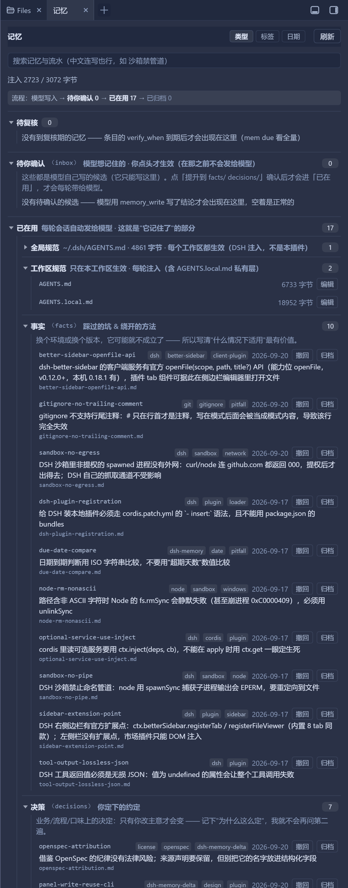

# dsh-memory-delta

[English](README.md) | 中文

**给 AI 编码助手的、分层自动注入的跨会话记忆。**
一个 DSH 插件 + 一个零依赖的独立 CLI。借鉴 [OpenSpec](https://github.com/Fission-AI/OpenSpec) 的
*规格 / 变更 / 归档* 纪律 —— 但走**推送**而不是拉取。

> **主仓库：[GitHub](https://github.com/lpf20200901/dsh-memory-delta)** ·
> [Gitee](https://gitee.com/xingluzhe/dsh-memory-delta) 是只读镜像 ——
> **issue / PR 请提到 GitHub**，提到镜像站会丢。

> 状态：**M1–M3 已完成并在真实 DSH 上实机验证**（差分注入 / 两个工具 / 蒸馏提醒）。
> 实机验证矩阵见下方「验证」。

## 为什么需要它

AI 编码助手有两个反复出现的毛病：

1. **新会话不记得任何事** —— 每个会话都要重新交代背景、偏好、结论。
2. **记住了也管不好** —— 全塞进一两个 Markdown，越写越大、越写越贵，而且**结论过时了没人删**。

已有的规格驱动工具（OpenSpec 等）解决的是"代码不跑偏"，但它们是**拉取式**：靠指令要求 AI 去读，
新会话不会主动想起来。dsh-memory-delta 走**推送**：会话一开始就把该知道的塞进上下文，但**只推最精炼的部分**，
而且**只推变化的部分**，细节按需检索。

## 设计要点

```
        ┌─ PUSH：会话开始自动注入（字节预算硬约束）
        │    T0 身份与约定   用户偏好 / 机器环境 / 账号约定
        │    T1 索引与待办   接着办什么
库 ─────┤
        └─ PULL：按需检索（不占常驻预算）
             inbox/      候选条目 —— **模型默认只能写这里**
             facts/      当前真相（只有 status=active 参与注入）
             decisions/  决策与理由（只增不改）
             archive/    被取代条目的归档
             journal.md  流水（永不注入）
```

**目录名要分两个轴看**（这一点以前没写清，容易被 `facts` 这个词误导）：

| 目录 | 在流程哪一步 | 记什么 | 谁能写 | 参与注入 |
| --- | --- | --- | --- | --- |
| `inbox/` | **候选**（还没确认） | 模型觉得值得长期留住的结论 | **只有模型**（`memory_write`） | ❌ 从不 |
| `facts/` | **常驻** | **踩过的坑 + 怎么绕开**：环境限制、工具行为、真实的失败与解法 | **只有人**（promote） | ✅ 每轮 |
| `decisions/` | **常驻** | **你定下的约定**：业务 / 流程 / 口味上的决定 —— 防止重复问你 | **只有人**（promote） | ✅ 每轮 |
| `archive/` | **归档** | 退场的旧结论：被取代（supersede）或不再适用（archive） | 取代/归档时自动搬 | ❌ 永不（但仍搜得到、能取回） |

主流程：**模型只能写 `inbox/` → 人确认后 `promote` 进 `facts/` 或 `decisions/` → 退场的进 `archive/`**。
拿不准放哪边就问："**明天世界变了，这条会不会失效？**" 会 → `facts/`；只有你改主意才失效 → `decisions/`。

**两条写起来的诀窍**：`facts/` 里写清**"什么情况下适用"**（坑的价值是"下次别再踩"，不是"曾经踩过"）；
`decisions/` 里写清**"为什么这么定"**（有了理由，下回它就能自己判断，不会再问你第二遍）。

> 这四个目录名（以及 `journal.md` / `index.md` / `memory.config.json`）的完整说明，`mem init`
> 会写进**库自己**的 `README.md` —— 打开记忆库目录就能看到，不用回来翻项目文档。

七条纪律：

- **推送的东西必须极小**：注入层里的内容每次会话都要花 token。所以流水、设计文档都不进注入层。
  实测一个 6 条目的真实记忆库：注入文本 **953 字节**，其中 68% 是条目行本身、约 300 字节是框架说明，
  **平均 159 字节/条** → 3 KB 默认预算装得下约 19 条。条目 id **故意不写进正文**（它随消息的
  结构化 `source.entries` 一起走），因为把 id 内联进正文曾吃掉 **34%** 的预算。
- **只推变化的部分**：每条条目带 12 位内容 hash，插件记住上一轮的状态，下一轮**只推新增/已更新/已失效**；
  **完全没变化时一个字都不注入**。（上游 `dsh-agent-instructions` 没有差分：文件一变就整篇重注入，
  实测一个会话里改 15 次某个 8.5 KB 的文件 ≈ 白烧 58k tokens。）
- **状态从会话历史恢复**：不存旁路状态文件，而是从自己发过的消息里读回 `{id: hash}` ——
  所以会话恢复 / 回放 / 压缩之后依然正确。
- **模型只写收件箱**：错误结论若静默进入常驻层，会被**反复注入**。提升需要显式 `promote`。
- **一个 key 一个真相**：事实/决策带语义键 `key`，同一个 `scope+key` 上**只能有一条 active**。
  新结论要进来，必须显式 `--supersedes` 旧的 —— 这是把"记忆腐化"挡在常驻层外的闸门。
- **结论有状态**：`active` / `superseded` / `expired`。被取代的打双向链接并归档，而不是无限追加。
- **纯 Markdown + frontmatter**：人可读、可 git diff、可 review、能像代码一样提交。

## 安装（作为 DSH 插件）

⚠️ 这段是**实机踩出来的**，两条弯路都别再走：

```text
❌ 往 package.json 的 dsh.profile.bundles 里加
   → DSH 启动时按市场注册表（.generations/desired.json）重新生成，未知条目被清掉

❌ 在 cordis.patch.yml 里写一个裸条目
   → 被静默忽略（patch 对不存在的 id 只做 config 覆盖/禁用）

✅ 在 cordis.patch.yml 里用 - insert: 包起来
```

**步骤**（`DSH_HOME` 通常是 `%APPDATA%\dsh-desktop\harness`）：

1. 把本包放进 profile 的 `node_modules`：

   ```
   <DSH_HOME>\profiles\web\node_modules\dsh-memory-delta\
       package.json
       bin\mem.mjs
       src\plugin.mjs  src\hook.mjs  src\planner.mjs
   ```

2. 在 `<DSH_HOME>\profiles\web\cordis.patch.yml` 末尾追加：

   ```yaml
   - insert:
       - id: dsh-memory-delta
         name: dsh-memory-delta
         config:
           root: ''             # 留空 = 会话工作目录下的 memory/
           maxBytes: 3072       # baseline 注入的字节预算
           enabled: true
           dueWithin: 0         # verify_when 提前几天提醒复核（0 = 只在已到期时）
           panel: true          # 侧边栏「记忆」页签的数据/动作路由
           allowWrite: true     # 允许面板按钮写记忆库（收件箱提升 / 整理文件名）
   ```

3. 保存即可 —— patch 层有 `watchUserPatches`，**会热加载，不需要重启**。

**卸载**：删掉 patch 里那段 `- insert:`，再删掉 `node_modules\dsh-memory-delta` 目录。

> 官方分发渠道（插件市场）的发布流程我还没摸；目前是本机安装方式。

### 插件提供什么

| 能力 | 说明 |
| --- | --- |
| **差分注入** | 首次注入全部 active 条目（baseline）；之后每轮只推「新增 / 已更新 / 已失效」；无变化时零注入 |
| `memory_search` | **按相关度排序**的检索，覆盖 facts / decisions / inbox / archive / journal / 会话索引。字段有权重（key/id > tags > 结论 > 正文）、整串短语有加成；中文按 **bigram** 匹配，所以 `沙箱禁管道` 能命中 `沙箱禁止命名管道`，不用手动加空格。每条结果带 score 与"命中最多的那一行"的片段 |
| `memory_write` | 把候选条目写进 inbox —— **模型不允许直接改事实层** |
| 蒸馏提醒 | 会话跑过若干轮而记忆已是最新时，提醒模型把本次结论落到 inbox；每会话只提醒一次，且提醒消息**不带状态**，不污染差分基线 |
| 到期复核提醒 | `verify_when` 不再是死字段：条目到了当初约定的复核期，会话里会**提醒一次**"这条结论可能过时了，请复核"，并给出该用哪条命令取代/标过期。写成**人话**的值（`等换机器时`）永远不会触发它（否则每个会话都弹一次、怎么改都消不掉）；只在"本轮本来不注入任何记忆"时才提醒，同样**不带状态** |
| 侧边栏「记忆」页签 | 装了 [dsh-better-sidebar](https://github.com/omdsh-dev/DSH-better-sidebar) 后，侧边栏多一个**记忆**页：**按流程阶段分组**（`待你确认 → 已在用 → 已归档`，每组一句人话 + 顶部一条流程条）、可折叠（自绘箭头）、**搜索框**（搜条目 + 流水，中文连写也行 —— 与 `mem recall`、模型用的 `memory_search` 是**同一套打分**）。「已在用」可按**三个维度**看：**类型**（事实/决策，回答"该放哪边"）/ **标签**（按主题）/ **日期**（什么时候记的，带"今天/昨天/周几"人话标注）。**点某条记忆 = 打开它那个 `.md`**（走 better-sidebar 的官方 `openFile`，在侧边栏编辑器里预览/编辑）。**双向迁移**：候选「提升到 facts/ decisions/」⇄ 常驻「撤回」，常驻还能「归档」、归档能「取回」，候选可「删除」——**危险动作一律走行内确认条**（不用会阻塞无头截图的浏览器原生 `confirm`）。「已在用」里还会显示**全局规范**（`~/.dsh/AGENTS.md`：DSH 注入、每个工作区都生效，只读预览 + 默认折叠）与**工作区规范**（`AGENTS.md` / `AGENTS.local.md`，**可直接点「编辑」进侧边栏编辑器** —— 它们在工作区内，编辑器允许打开）。客户端半边是**手写的零构建浏览器 bundle**（`window.__ModuleLoader__.load({id, factory})` 包装，不引入任何打包器）；数据来自本插件自己的只读路由 `POST /dsh-memory-delta/state` 与 `POST /dsh-memory-delta/search` —— 仅回环、JSON 进 JSON 出、不碰别的文件。唯一会**写**的路由是 `POST /dsh-memory-delta/action`（提升 / 撤回 / 归档 / 取回 / 删除候选 / 安全改名），可用 `allowWrite: false` 关掉 |
| 为什么不把"编辑/删除记忆"做进面板 | 侧边栏**本来就有**编辑器（点条目即打开）和文件树（重命名/删除带确认）。在面板里再造一套完整增删改 = 重复实现 + 长期维护负担，所以面板只做**入口**加**几个真正需要判断的动作**：打开文件、候选**提升**、常驻**撤回**、候选**删除**、**整理文件名**（`mem rename`：id + 文件名 + 引用一起改）。**"跳到目录"这类纯跳转按钮不做** —— 折叠箭头看内容 + 点条目打开详情已经够，多一个按钮只多一份噪音和一条会启动外部进程的路由。⚠️ **不要**用文件树直接给记忆条目改名 —— `id` 写在 frontmatter 里且必须与文件名一致，`mem validate` 会报 `id 与文件名不一致`；这正是不做自由改名、只做"安全改名"的原因。**常驻条目不能直接删**（那等于静默消失）—— 它的出路是「撤回」或取代/标过期 |

为什么插件**不去 spawn CLI**：DSH 沙箱禁止命名管道，捕获子进程输出会 EPERM；而且没必要 ——
插件直接 `import` 同一份 store 逻辑（`bin/mem.mjs` 只在被直接执行时才跑 CLI）。
它也不**强依赖**侧边栏：`webServer` 是通过 `ctx.get('webServer')` 读的**可选能力**，
所以 headless / 纯 CLI 组合下插件照常加载，只是不注册面板路由。



<sub>从侧边栏的 `+` 菜单打开的**「记忆」页签**：可折叠分组（标题后的等宽字是磁盘上的目录名）、
常驻条目与其语义键/标签/日期/文件名、待复核区、收件箱候选，以及当前记忆库每轮会话要花多少字节。
**点条目就在编辑器里打开它**（面板本身从不写记忆库；写操作只有收件箱的提升与整理文件名两个按钮）。</sub>

## CLI 用法

```bash
# 初始化（默认 <cwd>/memory，可用 --root 或 $DSH_MEMORY_ROOT 改）
mem init --root ./memory --scope "workspace:/path/to/project"

# 记一条候选（落在 inbox，不注入）
#   --id  推荐显式给短 id；不给则从结论派生（压到 20 字符，撞车自动加序号）
#   --key 语义键：一个 scope+key 上只能有一个 active 真相
mem new --type fact --id win-update-cache --key disk-cleanup \
        --conclusion "清更新缓存实测收益为零" \
        --reason "目录删空但可用空间未变" --tags windows,disk --source session-abc
# 只给 --key 不给 --id 时，**key 就是 id（也就是文件名）**：sandbox-no-pipe.md
# 不给 key 才退回「日期 + 截断的结论」派生 id（中文结论会被截在词中间，尽量给 key）

# 确认后提升到事实层；同 key 已有 active 时必须显式说明谁取代谁
mem promote win-update-cache
mem promote win-update-cache-v2 --supersedes win-update-cache

mem demote <id>             # 撤回：facts/decisions → inbox（"先不当真"，不改 status，还能再 promote 回去）
mem archive <id>            # 归档：不再适用**又没有替代** → archive/（status=expired；仍可搜、可 restore）
mem restore <id>            # 取回：archive/ → inbox（status 复位 active，再 promote 一次才重新生效）
mem rm <id>                 # 删除**候选**（只允许 inbox/）；常驻条目的出路是 demote / archive / 取代，不直接删

mem set <id> --key k --tags a,b --conclusion "…"   # 改已有条目（补 key / 改措辞 / 标 expired）
mem rename <旧id> <新id>    # 安全改名：frontmatter 的 id、文件名、别处的 supersedes 引用一起改
                           # （别用文件树手动改名 —— id 与文件名必须一致）
mem list --status active --tag windows
mem show <id>
mem validate [--fix]       # 格式/id/双向链接/环/同 key 冲突/索引/注入预算
mem index                  # 重建 index.md
mem inject [--json] [--budget 3072]   # 渲染应注入内容；--json 出带 hash 的差分载荷
mem recall <关键词> [--where all|facts|decisions|inbox|archive|journal|sessions|index] [--limit N] [--json]
                           # 按相关度排序；中文按 bigram 匹配，不用手动加空格
mem due [--within N] [--json]   # 到了 verify_when 复核期的条目（--within N 提前 N 天也算）
mem journal add "流水一行"
```

`verify_when` 可以写日期（`2027-03-01`），也可以写**相对条目自身日期**的说法
（`3个月后` / `2周后` / `立即`）；其它写法按"人话"处理，不会被自动提醒。

## 验证（实机）

在真实 DSH 会话里逐项确认过：

| 能力 | 实机证据 |
| --- | --- |
| baseline 注入 | 会话收到全部 active 条目 |
| 无变化 → 零注入 | 下一步没有重复注入，只补了一次蒸馏提醒 |
| delta·新增 | "新增：<新条目>"，并注明"其余 N 条未变化" |
| delta·已更新 | 改一条后只推"已更新：<该条>" |
| 到期复核提醒 | 加一条 `verify_when` 已过期 16 天的条目 → 下一个"无变化"的步骤弹出一次 `form='due'` 提醒，**再下一步零注入**（提醒没污染差分基线） |
| 侧边栏**记忆**页签 | 真机打开后显示真实库路径、"常驻 12 条"、"注入 1792 / 3072 字节"、事实/决策分组，以及（空的）收件箱 |
| `memory_search` / `memory_write` | 真机调用成功 |
| 写入只落 inbox | 写进去的候选**确实没进注入载荷**，promote 后才以 delta 出现 |

## 开发

```bash
npm test        # 825 个断言，零依赖
```

| 套件 | 断言 | 覆盖 |
| --- | --- | --- |
| `test/run-tests.mjs` | 180 | CLI 端到端（含非 ASCII 路径回归、相关度检索、`mem due`、`mem rename` 与引用同步、key 当文件名） |
| `test/planner-tests.mjs` | 43 | 差分算法（纯逻辑） |
| `test/search-tests.mjs` | 51 | 分词 / 打分 / 片段选择（纯逻辑） |
| `test/due-tests.mjs` | 93 | `verify_when` 解析（日期、相对说法、人话）与到期收集（纯逻辑） |
| `test/hook-tests.mjs` | 63 | 插件接线（假 agent / decision）：差分注入、蒸馏提醒、到期提醒 |
| `test/plugin-tests.mjs` | 217 | 插件集成（桩 DSH 模块，真 apply + 两个工具 + 两条面板路由 + promote/rename 真的写库 + 白名单/来源校验） |
| `test/client-tests.mjs` | 178 | 侧边栏面板 bundle（假 React + 假 `fetch`：分组/折叠、点条目调 openFile、提升/整理文件名、失败态） |

`test/plugin-tests.mjs` 用 `test/stubs/` 下的桩模块替换 4 个 `@deepseek-ai/*` 包，
通过 `test/stub-loader.mjs` **真正 `apply()` 这个插件并驱动它**，所以即使没有 DSH 也能验证插件行为。
另有 `test/preflight-import.mjs`：把包放进 profile 后用**真实** `@deepseek-ai/*` 模块跑一遍
（真实 `defineTool` 是否接受工具定义、真实 `schemastery` 是否接受配置 schema）。

几条从真实踩坑固化来的**回归测试**：

- 路径含**非 ASCII** 字符时，Node 的 `fs.rmSync` 会**静默失败**（配 `recursive` 时甚至崩进程），
  必须用 `unlinkSync`；
- DSH 沙箱禁止命名管道，`spawnSync` 默认的 `stdio:'pipe'` 会 EPERM，测试要把输出重定向到**文件**；
- 工具写出的条目 scope 必须跟随**会话工作区**，不能落到 harness 进程的 cwd；
- `new URL(import.meta.url).pathname` 会把**非 ASCII 用户名百分号编码**
  （`C:\Users\李鹏飞` → `C:\Users\%E6%9D%8E%E9%B9%8F%E9%A3%9E`），"往插件目录里写"就变成
  "往一个根本不存在的路径里写" —— 一律用 `fileURLToPath`；
- 内部函数只给**部分** return 路径补字段（`due`），解构出来就是 `undefined`，每一步都抛错、
  又被外层 try/catch 包装成"加载记忆失败" —— 于是有了防御式取值 + "零告警"断言。

## 路线图

- **M1 ✅** CLI + 结构化条目 + validate + 索引/注入预算
- **M2 ✅** 显式短 id、语义键与「一个 key 一个真相」、`inject --json` 差分载荷、`validate --fix`、`mem set`
- **M3 ✅** DSH 插件：差分注入 + 两个工具 + 蒸馏提醒（已实机验证）
- **M4 ✅** 发布（GitHub 主 / Gitee 镜像）
- **M5 ✅** 让记忆"规模上真的可用"：注入改索引式（正文不写 id，平均约 159 字节/条）、
  按相关度排序的检索（中文 bigram）、`verify_when` 落地成**到期复核提醒**
- **下一步** 条目变多时保持注入体积可控；发布到 npm

## 借鉴与致谢

「**规格 / 变更 / 归档**」这套纪律 —— 一份人可读的**当前真相**，加上一份待生效的变更集，落地后归档 ——
借鉴自 [OpenSpec](https://github.com/Fission-AI/OpenSpec)（MIT）。

dsh-memory-delta 是**独立实现**：不包含、也不调用 OpenSpec 的任何代码，存储格式与 CLI 都是自研的；
而且方向是反的 —— 记忆是**被推**进会话，而不是等 agent 来**拉**。

「OpenSpec」是其作者的项目名/商标；本文只作**来源说明**，不表示与该项目的关联或背书。

## 许可

MIT
